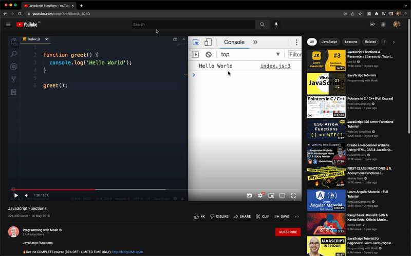

# Code OCR - Extract Code from image VS Code Extension

This extension extracts code from an image file/url and creates a new file with that code in VS Code.

## Features

 

## Run Locally

- Clone the project
- Run `npm install` in the project directory
- Press F5 to run extension development host

## Installing VSIX File

- Run `code --install-extension code-ocr-0.0.1.vsix` in the project directory.
- Or, under extensions from Activity Bar, select install from VSIX and choose `code-ocr-0.0.1.vsix` file in the project root directory.
